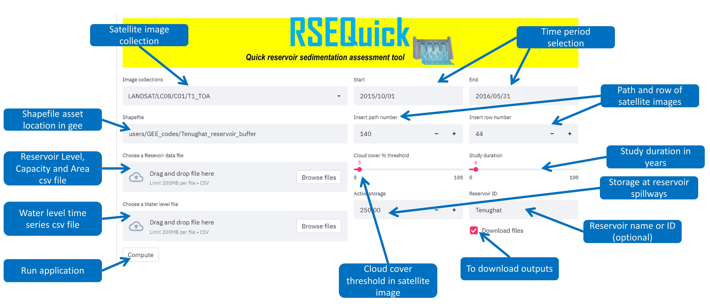
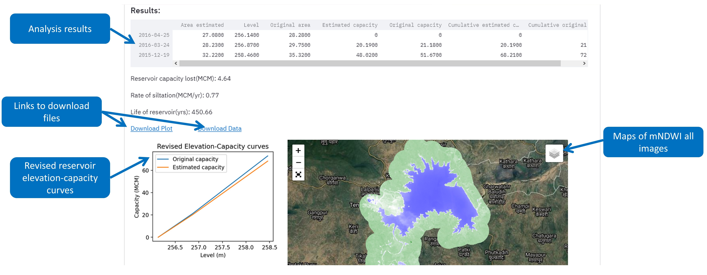

# RSEQuick

_Quick Reservoir Sedimentation assessment_

The RSEQuick uses Google Eart Engine (GEE) python api to compute reservoir sedimenation using Landsat satellite data and ground reservoir data. It is also hosted on heroku you find the app link below.

### RSE app link: [RSEQuick](https://rse-quick.herokuapp.com "rse-quick")

### Ground data required:

* Water level time series
* Elevation-capacity-area information

### Required Inupts:

### Reservoir data file format

|Level|Capacity|Area|      
|----|-----|-------|     
|227.5|0.0|0.0| 
|228.5|8.5|1.81|

### Units
- Level: m
- Capacity: MCM
- Area: mM2

### Water level data file format

|Date|Level(m.)|    
|----|-----|     
|01-01-2015|350.5|
|02-01-2015|351.2|

	*Observed water level must cover the study time period

### Tool Outputs:

## Steps to Run RSEQuick in local machine

- Download repository and go to the folder in your console
- Install required packages as mentioned in requirement.txt
- Run command "streamlit run RSEQuick.py"; application window will pop-up in your browser

**Source code (python)could also be modified to work with other satellite images.** 